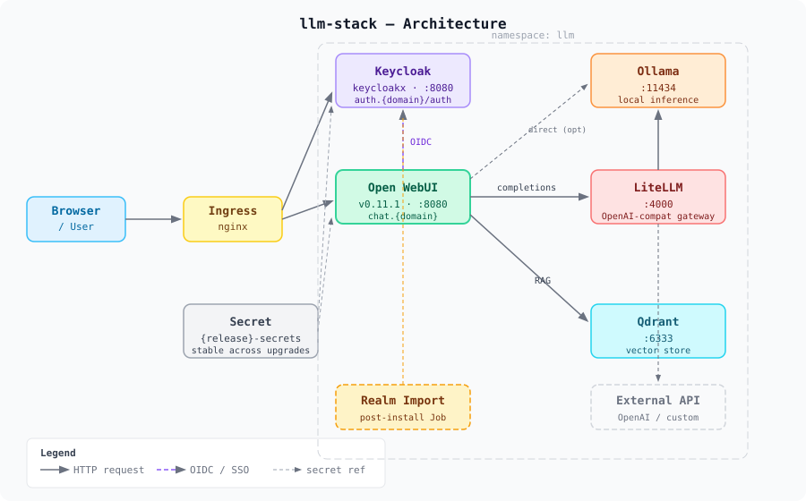

# llm-stack

[](https://github.com/ufukdev/llm-stack/actions/workflows/ci.yml)
[](https://helm.sh)
[](LICENSE)

A self-hosted LLM stack as a single Helm umbrella chart. Designed for teams that cannot send data outside and need to integrate with an existing identity provider.

## What's included

| Component | Chart | Purpose |
|-----------|-------|---------|
| [Open WebUI](https://github.com/open-webui/open-webui) | `open-webui` | Chat interface |
| [Ollama](https://ollama.com) | `ollama` | Local model inference |
| [LiteLLM](https://github.com/BerriAI/litellm) | `litellm-helm` | OpenAI-compatible gateway |
| [Qdrant](https://qdrant.tech) | `qdrant` | Vector store for RAG |
| [Keycloak](https://www.keycloak.org) | `keycloakx` | SSO / OIDC identity provider |

## Architecture



## Prerequisites

- Kubernetes ≥ 1.25
- Helm ≥ 3.14
- A default StorageClass (for persistent volumes)
- Optional: an Ingress controller (nginx) and cert-manager for TLS

## Quick start (kind)

```bash
# Create a local cluster
kind create cluster --name llm-stack

# Add required chart repositories
helm repo add open-webui   https://helm.openwebui.com/
helm repo add codecentric  https://codecentric.github.io/helm-charts
helm repo add qdrant       https://qdrant.github.io/qdrant-helm
helm repo add ollama       https://otwld.github.io/ollama-helm/
helm repo update

# Install with the local CI values (no Ingress, no SSO, Keycloak disabled)
helm install llm charts/llm-stack \
  --kube-context kind-llm-stack \
  -n llm --create-namespace \
  -f charts/llm-stack/ci/kind-values.yaml

# Access Open WebUI
kubectl -n llm port-forward svc/llm-open-webui 8080:80
# Open http://localhost:8080
```

## Configuration

All top-level keys are defined in [`charts/llm-stack/values.yaml`](charts/llm-stack/values.yaml) and validated by [`values.schema.json`](charts/llm-stack/values.schema.json).

### Key options

| Key | Default | Description |
|-----|---------|-------------|
| `global.domain` | `""` | Base domain for Ingress hosts (`chat.{domain}`, `auth.{domain}`) |
| `inference.mode` | `local` | `local` (Ollama) or `external` (bring your own endpoint) |
| `openWebui.enabled` | `true` | Deploy Open WebUI |
| `ollama.enabled` | `true` | Deploy Ollama for local inference |
| `qdrant.enabled` | `true` | Deploy Qdrant vector store |
| `keycloak.enabled` | `true` | Deploy Keycloak for SSO |
| `litellm.enabled` | `false` | Deploy LiteLLM gateway |
| `networkPolicy.enabled` | `false` | Deploy NetworkPolicies (requires Calico/Cilium) |
| `ingress.enabled` | `false` | Deploy Ingress resources |

### Secrets

Secrets (`litellmMasterKey`, `oidcClientSecret`, `keycloakAdminPassword`) are generated on first install and remain stable across upgrades via Helm `lookup`. You can pin them explicitly:

```yaml
secrets:
  litellmMasterKey: "your-master-key"
  oidcClientSecret: "your-oidc-secret"
  keycloakAdminPassword: "your-admin-password"
```

Or use `--set secrets.litellmMasterKey=...` without committing secrets to version control.

## Scenarios

### Local inference (default)

Ollama runs inside the cluster. All model weights are downloaded on first start.

```yaml
inference:
  mode: local

ollama:
  enabled: true
  ollama:
    models:
      pull:
        - qwen2.5:0.5b   # or llama3.1:8b, mistral, etc.
```

See [`ci/kind-values.yaml`](charts/llm-stack/ci/kind-values.yaml) for a complete local example.

### GPU acceleration

Requires the NVIDIA GPU Operator. See [`examples/values-gpu.yaml`](charts/llm-stack/examples/values-gpu.yaml).

### External inference endpoint

Point Open WebUI (via LiteLLM) at an external OpenAI-compatible API:

```yaml
inference:
  mode: external
  external:
    baseUrl: "https://api.example.com/v1"
    apiKey: "sk-..."

ollama:
  enabled: false
```

See [`ci/external-inference-values.yaml`](charts/llm-stack/ci/external-inference-values.yaml).

### Air-gapped deployment

All images mirrored to an internal registry, no internet egress required.  
See [`examples/values-airgapped.yaml`](charts/llm-stack/examples/values-airgapped.yaml).

### External OIDC provider (no Keycloak)

Use Okta, Azure AD, Authentik, or any other OIDC-compatible IdP:

```yaml
keycloak:
  enabled: false

oidc:
  external:
    enabled: true
    issuerUrl: "https://sso.example.com/auth/realms/my-realm"
    clientId: "open-webui"
    clientSecret: "..."   # use --set, never commit
```

See [`examples/values-external-idp.yaml`](charts/llm-stack/examples/values-external-idp.yaml) and [`ci/external-oidc-values.yaml`](charts/llm-stack/ci/external-oidc-values.yaml).

## SSO / Keycloak

When `keycloak.enabled=true`, a post-install Job imports the `llm-stack` realm automatically. The realm includes an `open-webui` OIDC client, `llm-user`/`llm-admin` roles, and matching groups.

See [`docs/sso.md`](docs/sso.md) for full details.

## NetworkPolicy

When `networkPolicy.enabled=true`, three policies are applied:

1. **default-deny-egress** — blocks all outbound traffic from the namespace by default
2. **allow-internal** — allows intra-namespace traffic and DNS (kube-system port 53)
3. **allow-webui-egress-https** — allows Open WebUI pods to reach HTTPS endpoints (required for model registry and HuggingFace embedding model download on startup)

Requires a CNI that enforces NetworkPolicies (Calico, Cilium). To test locally:

```bash
bash hack/kind-with-calico.sh
```

## Development

```bash
# Lint the chart
helm lint charts/llm-stack --strict

# Lint with chart-testing
ct lint --config ct.yaml

# Update dependencies
helm dependency update charts/llm-stack

# Render templates without installing
helm template llm charts/llm-stack -f charts/llm-stack/ci/kind-values.yaml
```

## License

[Apache 2.0](LICENSE)
